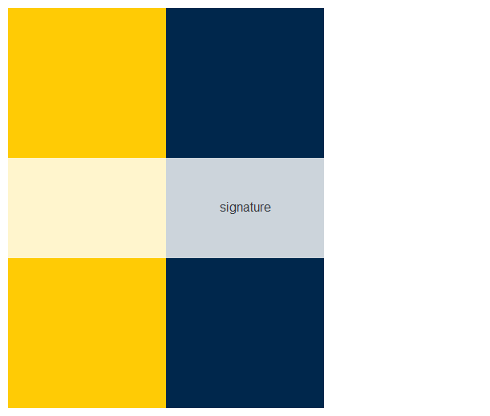
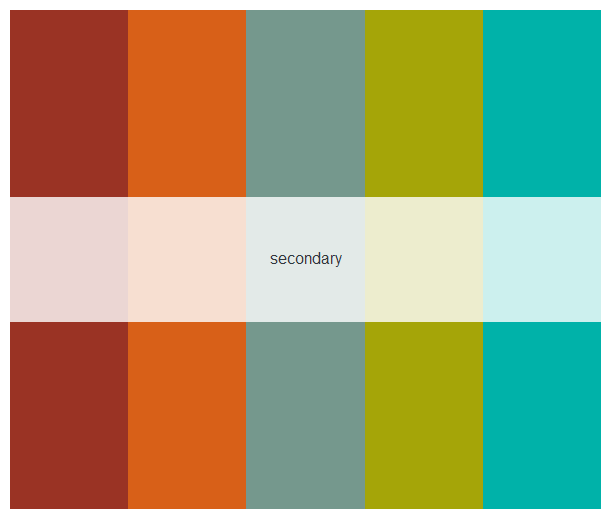
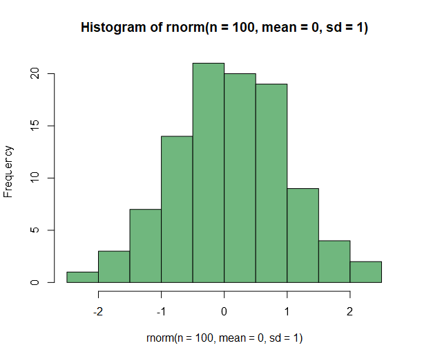

# maizeandblue
Contains code for R package with R color palettes inspired by the University of Michigan.
Code adopted from the lovely `inauguration` R package by Cianna Bedford-Petersen, available [here](https://github.com/ciannabp/inauguration). 

# R package installation
Install the  `maizeandblue` R package using the following code:
``` r
#install.packages("devtools")
devtools::install_github("kimhochstedler/maizeandblue", ref="main")
library(maizeandblue)
```

# Using the maizeandblue package
Use the `names` function to view the available color palettes.
```r
names(umich_palettes)
#> [1] "signature"   "secondary" "bills_beer_garden"
```

Call the palette using the `render_umich_colors` function
```r
render_umich_colors("signature")
```


View a subset of the secondary color scheme
```r
render_cornell_colors("secondary", 5)
```


Use colors from `umich_palettes` in your graphs
```r
set.seed(1)
hist(rnorm(n = 100, mean = 0, sd = 1), col = umich_palettes[["bills_beer_garden"]][2])
```

